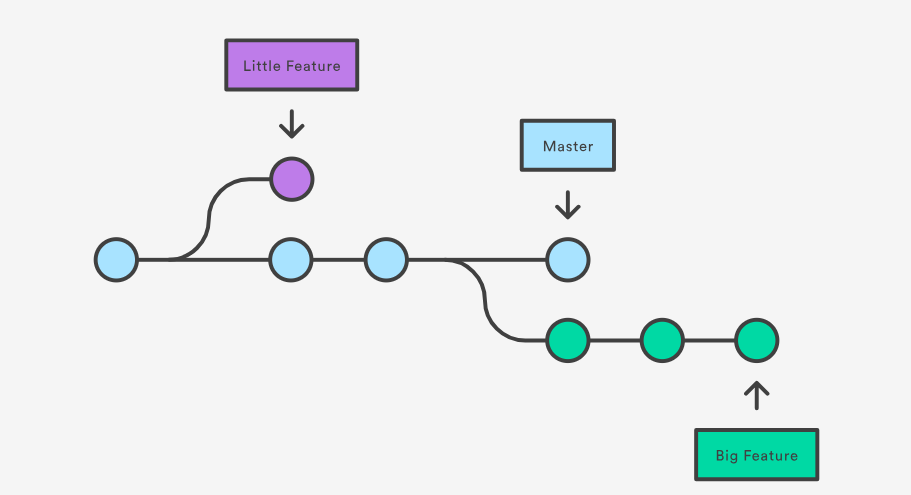
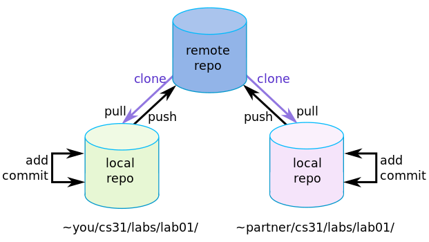
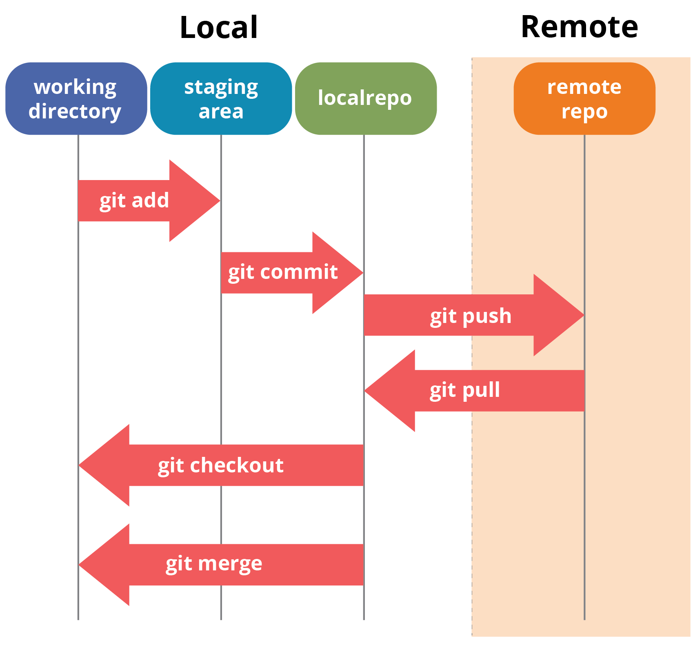

# intro-to-git
This repository is an introduction to Git. Each of the sections describes some aspect of using Git, but if you're learning independently I suggest starting with [this comprehensive tutorial](https://product.hubspot.com/blog/git-and-github-tutorial-for-beginners).

## The README file
Every repository should have a README file: it explains what the repository is for and how to use it. The README file is styled using Markdown
* [What is Markdown?](https://en.wikipedia.org/wiki/Markdown)
* [Styling with Markdown](https://guides.github.com/features/mastering-markdown/)

## Key concepts in Git
### Versions


### Repository


### Git commands


More information [here](https://franiglesias.github.io/git-key-concepts/) and [here](https://guides.github.com/introduction/git-handbook/)


## Setting up a new repository
1. Create a repository on Github as described [here](https://guides.github.com/activities/hello-world/#repository)
2. Clone it to create a local copy of the files
```
git clone https://github.com/your-username/your-repository.git
```
3. Set your authentication details for this repository. On your own computer you can use `global` settings, but in the labs you need to use `local`. This will allow you to commit changes 
```
git config --local user.name "your name"
git config --local user.email "your email address"
```

## Tracking changes to files
1. View recent commits `git log`
2. View the changes of a particular commit with `git show` and the ID of the commit
2. Check what files have changed since last commit `git status`
3. What are the changes in those files `git diff`
4. Add changed files to `staging` with `git add filename`
5. Create a new commit with these changes `git commit -m "This message describes the changes"'.

## Sharing with the remote repository
1. Get the latest changes from the remote repository `git pull`
2. Push your local changes on a particular branch to the remote repository `git push origin master`

## Collaboration workflow
1. One common strategy is [Gitflow](https://datasift.github.io/gitflow/IntroducingGitFlow.html)
2. `master` branch is the one that gets deployed to production
3. A `develop` branch is created to hold peer-reviewed code waiting to be deployed
4. New branches are created to work on particular features (called feature branches)
5. Code in feature branches is *peer reviewed* in a *pull request* and *merged* into the develop branch
